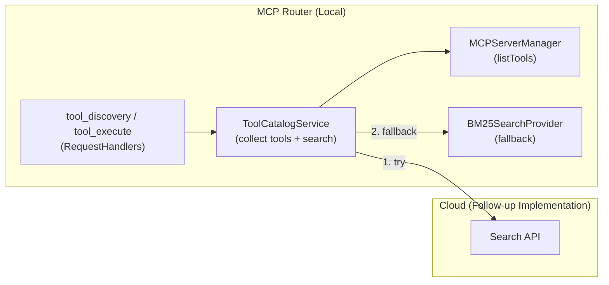

# Tool Catalog & Search Design

## TL;DR
- Search/execution is provided via fixed MCP meta-tools `tool_discovery` / `tool_execute`; no dynamic tool addition.
- Available Tool List is collected at search request time and searched via Cloud Search API. Falls back to local BM25 on failure.
- Filtering by token, project, `tool_permissions`, and server status is applied locally. Search targets/results are tools only.
- UI changes are minimal. No additional search UI/CLI; frontend uses meta-tools.

## Current State and Issues
- `AggregatorServer` + `RequestHandlers` aggregates multiple MCP servers; HTTP entry point `MCPHttpServer` attaches `_meta.token/_meta.projectId` and forwards.
- Server config and status are held by `MCPServerManager` + SQLite (including `servers.tool_permissions`). Tool/resource/prompt metadata is not persisted; fetched each time via `listTools/listResources/listPrompts`.
- On workspace switch, DB/services reset. `PlatformAPI` lacks catalog search capabilities; search unavailable from UI/CLI. LLM has no fixed meta-tools and cannot perform natural language search/execute.

## Goals and Non-Goals

### Phase 1: Local Search (Current)
- Goals
  - Enable LLM/existing MCP clients to search and execute while maintaining project/token boundaries via `tool_discovery` / `tool_execute`.
  - Provide local search using BM25 algorithm.
  - Dynamically collect Available Tool List at search request time; no pre-indexing required.
- Non-Goals
  - No new CLI commands or dedicated search UI.
  - Tool execution count aggregation and recommendations are follow-up.
  - No dynamic tool addition/updates via `listTools` (fixed 2 tools only).
  - Prompt/resource search is out of scope.
  - No local catalog DB persistence.

### Phase 2: Cloud Search (Follow-up)
- Goals
  - Provide advanced search via Cloud Search API (LLM-based selection, etc.).
  - Fallback strategy: Cloud Search API → failure → fallback to local BM25.
- Non-Goals
  - Catalog sync to cloud (unnecessary as Available Tool List is sent at request time).

## Use Cases / Requirements
- Feature: Search tools with natural language query + `maxResults`, return scored results.
- Execution: Execute via `tool_execute` with `toolKey`/`arguments`, validate `tool_permissions`/status/token boundary.
- Audit: Log search requests to `mcp-logger`.
- Security: Clarify handling when token is not specified (default deny). `tool_permissions=false` excluded from search. `projectId` mismatch excluded.

## Architecture Overview
- Local: Collect Available Tool List from running servers at search request time, delegate to search provider.
- Search Provider: Cloud Search API (priority) → Local BM25 (fallback).
- Entry Point: Search/execution unified via MCP meta-tools.

## Project Settings

Tool catalog can hold per-project settings. Settings are stored in the `optimization` column of the `projects` table.

### Configuration Items
```typescript
// packages/shared/src/types/project-types.ts
type ToolCatalogSearchStrategy = 'bm25' | 'cloud';
type ProjectOptimization = ToolCatalogSearchStrategy | null;

// projects.optimization column: ProjectOptimization
// - null: Tool catalog disabled
// - 'bm25': Local BM25 search
// - 'cloud': Cloud search (to be implemented in Phase 2)
```

### Behavior
- When `optimization = null`, `tool_discovery` returns empty results.
- Even when `optimization = 'cloud'` is selected, falls back to BM25 if cloud search is unavailable.

### UI
- Edit "Context Optimization" from project settings modal (gear icon).
- Toggle OFF → `optimization = null` (disabled)
- Toggle ON + strategy selection → `optimization = 'bm25'` or `'cloud'`

## Components and Responsibilities

### Local (Router/Electron)
- ToolCatalogService (Integrated Service): Provides the following integrated features.
  - **Tool List Collection**: Execute `listTools` from running servers held by `MCPServerManager` at search request time, build Available Tool List filtered by `tool_permissions`/`projectId`/`serverStatusMap`.
  - **Search Provider Management**: Implement fallback strategy: Cloud Search API → Local BM25.
- SearchProvider Interface: Abstraction of search algorithms.
  - `BM25SearchProvider`: Local BM25 search (for fallback).
  - `CloudSearchProvider` (follow-up): Cloud Search API calls.
- RequestHandlers (Meta-tools): Add `tool_discovery` / `tool_execute` to `AggregatorServer`/`RequestHandlers`. Capture in `CallTool`, delegate to `ToolCatalogService`. `ListTools` returns only fixed 2 tools.
- Logging: Send `tool_discovery`/`tool_execute` call results to `mcp-logger`.

### Cloud (Follow-up)
- Search API: `/catalog/search` receives Available Tool List and Query, selects and returns appropriate tools.
- Auth: Verify Router-issued token via Bearer. Access control at `projectId` boundary.

## API and Schema

### Cloud REST (Draft)
- `POST /catalog/search`
  ```ts
  type ToolInfo = {
    toolKey: string; // `${serverId}:${toolName}`
    toolName: string;
    serverName: string;
    description?: string;
  };
  type SearchRequest = {
    query: string[]; // Search Queries
    context?: string; // Background information or task description
    tools: ToolInfo[]; // Available Tool List
    maxResults?: number;
  };
  type SearchResult = {
    toolKey: string;
    toolName: string;
    serverName: string;
    description?: string;
    relevance: number;      // 0-1 normalized score
    explanation?: string;   // Selection reason
  };
  type SearchResponse = { results: SearchResult[] };
  ```

### MCP Meta-tool `tool_discovery`
- Input (CallTool `arguments`):
  ```ts
  {
    query: string[]; // Search Queries
    context?: string; // Background information or task description (for Cloud search)
    maxResults?: number;
  }
  ```
- Output:
  ```ts
  {
    results: Array<{
      toolKey: string;
      toolName: string;
      serverName: string;
      description?: string;
      relevance: number;      // 0-1 normalized score
      explanation?: string;   // Optional explanation (selection reason, etc.)
      outputSchema?: object;  // JSON Schema for structured output (MCP 2025-03-26)
      annotations?: {         // Behavioral hints for clients (MCP 2025-03-26)
        title?: string;
        readOnlyHint?: boolean;
        destructiveHint?: boolean;
        idempotentHint?: boolean;
        openWorldHint?: boolean;
      };
    }>;
  }
  ```
- Implementation:
  1. Capture in `CallTool`
  2. Collect Available Tool List locally (filter by `TokenValidator`/`toolPermissions`/`serverStatusMap`/`projectId`)
  3. Search via Cloud Search API (fallback to local BM25 on failure)
  4. Return selection results

### MCP Meta-tool `tool_execute`
- Design Background: Some LLMs and MCP clients are fixed to the tool list at conversation start, so wrapped via fixed meta-tool to enable dynamic tool execution.
- Input (CallTool `arguments`):
  ```ts
  {
    toolKey: string; // `${serverId}:${toolName}` etc.
    arguments?: unknown;
  }
  ```
- Output:
  ```ts
  {
    result: unknown;
  }
  ```
- Implementation: Capture in `CallTool` → Validate `TokenValidator`/`toolPermissions`/`serverStatusMap`/`projectId` → Delegate `tools/call` to target server.

## Main Flows

### Search
1. Client calls `tool_discovery` via MCP CallTool (with `_meta.token/_meta.projectId`).
2. `ToolCatalogService` collects Available Tool List from running servers (pre-filtered by `TokenValidator`, `toolPermissions`, `serverStatusMap`, `projectId`).
3. Delegate to search provider:
   - **Cloud Search (Priority)**: Send Query and Available Tool List to `/catalog/search`.
   - **Fallback on Failure**: Score candidates with local BM25 search.
4. Return selection results as MCP response.

### Execute
1. Client/LLM calls `tool_execute` via MCP CallTool (with `_meta.token/_meta.projectId`).
2. Validate `TokenValidator`/`toolPermissions`/`serverStatusMap`/`projectId`.
3. Delegate `tools/call` to target server and return result.

## Error Handling and Security
- Token: Reject search/execution when `_meta.token` is missing (optionally allow per requirements). Display 401/403 in UI.
- Project: When `_meta.projectId` is `UNASSIGNED_PROJECT_ID` or empty, treat as null and apply filter.
- Fallback: Cloud Search API has short timeout (e.g., 5s). Fallback to local BM25 on error.
- Logging: Record to local log including `requestId`, `serverId`.

## Phased Implementation Plan

### Phase 1: Local Search ✅
1. Type preparation: Add `SearchRequest/SearchResponse` types to `packages/shared`.
2. SearchProvider Interface: Abstraction of search algorithms.
3. BM25SearchProvider: Implement local BM25 search.
4. ToolCatalogService: Collect Available Tool List at search request time, delegate to SearchProvider.
5. MCP Meta-tools: Add `tool_discovery` / `tool_execute` to `RequestHandlers`.

### Phase 2: Cloud Search (Follow-up)
1. CloudSearchProvider: Implement Cloud Search API client.
2. Fallback Strategy: Implement Cloud → BM25 fallback logic in ToolCatalogService.
3. Measurement/Testing: Evaluate cloud search accuracy, test fallback behavior.

## Measurement and Test Perspectives
- Smoke: Can search with `tool_discovery`, can execute with `tool_execute`.
- Load: Measure search response time with 10+ servers.
- Reliability: Verify fallback behavior on cloud search failure.
- Regression: Confirm `listResources/listPrompts` work as before, `listTools` returns only fixed 2 tools.

## Risks / Open Issues
- Stabilization and versioning of Search API schema. How to maintain backward compatibility.
- How much to display results from non-running servers (currently assumed excluded).
- Need to finalize policy for when token is not specified.

## Architecture Diagram (Mermaid)

